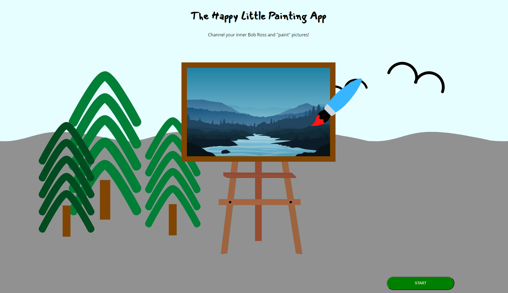

# MintBean Hackathon Challenge: Becoming Bob Ross :paintbrush:
**Challenge: Create an app that lets people express their creativity in a visual format.**

**Our Project: In the spirit of Bob Ross, we built a [Happy Little Painting App](https://happy-little-painting-app.netlify.app)!**

***"We don't make mistakes, just happy little accidents."*** -Bob Ross, 1942-1995
## Landing Page

## Tools
**Tech: HTML, CSS, JavaScript, and Canvas API**

Our team was excited to utilize a graphics API, and Canvas API was perfect for our purposes.
## Optimizations

Optimizations are a work in progress! The Canvas documentation recommends using the offscreen canvas for scaling and repeating objects; this is a consideration for when we add features to our app.

## Lessons Learned
The amount of information on Canvas API is overwhelming. We thought the bulk of the work would be in JavaScript but our CSS file grew quickly, too! Bringing an API into a project can require extra time with documentation and tutorials. 
## Deployment
We chose to deploy our app to Netlify. Netlify offers continuous deployment via GitHub and the option to create a back end with login, sharing, and other features in the future. 

Click [here](https://happy-little-painting-app.netlify.app) to see our app and draw your own happy little trees!
## Developers/Designer
### Bridget Brevik, Designer

Bridget is a full-stack software engineer turned UI/UX designer who spends her free time sailing and helping newcomers to the tech industry build their networking skills. Click [here](https://thedeveloperbee.com/) to view her portfolio!
### Meera Ramesh, Developer

Meera is a full-stack software engineer and data visualization tools enthusiast who loves to bake! Her goal is to work with companies that empower and uplift women. Click [here](https://meeraportfolio.netlify.app/) to view her portfolio!

### Jennifer Toops, Developer

Jennifer is a full-stack software engineer currently in a love-hate relationship with React. Click [here](https://jennifertoops.netlify.app) to view her portfolio!   

## App in Action!

